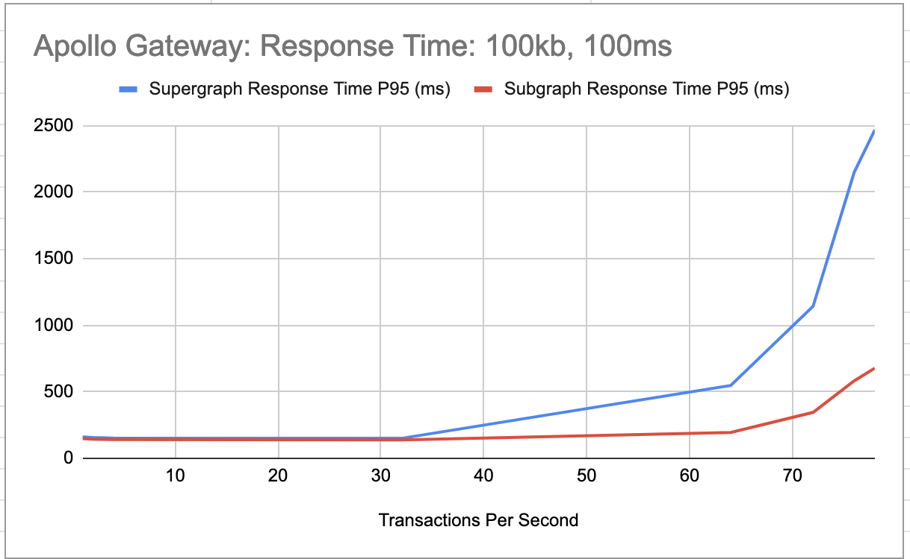

# Apollo-Gateway 100KB Response Payload Perf Results

## Perf Setup
* Response Payload = 100kb

More details are in this page: [Perf Setup](../perf-test-setup.MD)

## Synthetic Latency of 100ms

* Max TPS that could be achieved for this load is 78 transactions per second (TPS).
* Supergraph scales well without any degration till 32 TPS.  
* Time spent in the supergraph(supergraph time - subgraph time)
  * <=32 TPS: ~12 ms
  * 32 < TPS >= 78: 353-1790ms (upto 2.6x more than the time spent in subgraph)

* System metrics CPU and Memory didn't breach the "request" values provided.

| System Metric | Max Usage in test | Request Value | Limit Value |
| --- | --- | --- | --- |
| CPU (millicore)| 1260 | 1500 | 2000 |
| Memory (MB) | 246 | 3000M | 4000M |
* For this request, Apollo Gateway is CPU bound

### Test Result

| Transactions Per Second | Synthetic Latency | Client Response Time P95 (ms) | Supergraph Response Time P95 (ms) | Subgraph Response Time P95 (ms) | Time spent in Supergraph (ms) | CPU (millicore) | Memory (MB) | Screenshot |
| --- | --- | --- | --- | --- | --- | --- | --- | --- |
| 1 | 100 | 165 | 160 | 148 | 12 | 25 | 80 | [1tps-time.png](./100msLatency/1tps-time.png) \| [1tps-sys.png](./100msLatency/1tps-sys.png)
| 2 | 100 | 160 | 156 | 144 | 12 | 40 | 80 | [2tps-time.png](./100msLatency/2tps-time.png) \| [2tps-sys.png](./100msLatency/2tps-sys.png)
| 4 | 100 | 156 | 152 | 141 | 11 | 73 | 83 | [4tps-time.png](./100msLatency/4tps-time.png) \| [4tps-sys.png](./100msLatency/4tps-sys.png)
| 16 | 100 | 154 | 150 | 139 | 11 | 309 | 88 | [16tps-time.png](./100msLatency/16tps-time.png) \| [16tps-sys.png](./100msLatency/16tps-sys.png)
| 32 | 100 | 154 | 150 | 138 | 12 | 722 | 146 | [32tps-time.png](./100msLatency/32tps-time.png) \| [32tps-sys.png](./100msLatency/32tps-sys.png)
| 64 | 100 | 864 | 547 | 194 | 353 | 1024 | 182 | [64tps-time.png](./100msLatency/64tps-time.png) \| [64tps-sys.png](./100msLatency/64tps-sys.png)
| 128 | 100 | timeout error | - | - | - | - | - | [128tps-time.png](./100msLatency/128tps-time.png) \| [128tps-sys.png](./100msLatency/128tps-sys.png)
| 96 | 100 | timeout error | - | - | - | - | - | [96tps-time.png](./100msLatency/96tps-time.png) \| [96tps-sys.png](./100msLatency/96tps-sys.png)
| 80 | 100 | timeout error | - | - | - | - | - | [80tps-time.png](./100msLatency/80tps-time.png) \| [80tps-sys.png](./100msLatency/80tps-sys.png)
| 72 | 100 | 1775 | 1142 | 345 | 797 | 1175 | 205 | [72tps-time.png](./100msLatency/72tps-time.png) \| [72tps-sys.png](./100msLatency/72tps-sys.png)
| 76 | 100 | 3402 | 2150 | 582 | 1568 | 1250 | 249 | [76tps-time.png](./100msLatency/76tps-time.png) \| [76tps-sys.png](./100msLatency/76tps-sys.png)
| 78 | 100 | 3829 | 2467 | 677 | 1790 | 1260 | 246 | [78tps-time.png](./100msLatency/78tps-time.png) \| [78tps-sys.png](./100msLatency/78tps-sys.png)

## Synthetic Latency of 5s

* Max TPS that could be achieved for this load is 58 transactions per second (TPS).
* Supergraph scales well without much degration till 32 TPS.  
* Time spent in the supergraph(supergraph time - subgraph time)
  * <=32 TPS: 11-16 ms
  * 32 < TPS >= 58: 3s-5s (upto 2x more than the time spent in subgraph)

* System metrics CPU and Memory didn't breach the "request" values provided.

| System Metric | Max Usage in test | Request Value | Limit Value |
| --- | --- | --- | --- |
| CPU (millicore)| 985 | 1500 | 2000 |
| Memory (MB) | 441 | 3000M | 4000M |
* For this request, Apollo Gateway is CPU bound

### Test Result

| Transactions Per Second  | Client Response Time P95 (ms) | Supergraph Response Time P95 (ms) | Subgraph Response Time P95 (ms) | Time spent in Supergraph (ms) | CPU (millicore) | Memory (MB) | Screenshot |
| --- | --- | --- | --- | --- | --- | --- | --- |
| 1 | 5067 | 5062 | 5049 | 13 | 29 | 85 | [1tps-time.png](./5000msLatency/1tps-time.png), [1tps-sys.png](./5000msLatency/1tps-sys.png)|
| 2 | 5062 | 5057 | 5045 | 12 | 52 | 87 | [2tps-time.png](./5000msLatency/2tps-time.png), [2tps-sys.png](./5000msLatency/2tps-sys.png)|
| 4 | 5059 | 5055 | 5043 | 12 | 98 | 90 | [4tps-time.png](./5000msLatency/4tps-time.png), [4tps-sys.png](./5000msLatency/4tps-sys.png)|
| 8 | 5056 | 5052 | 5041 | 11 | 187 | 111 | [8tps-time.png](./5000msLatency/8tps-time.png), [8tps-sys.png](./5000msLatency/8tps-sys.png)|
| 16 | 5054 | 5050 | 5039 | 11 | 308 | 160 | [16tps-time.png](./5000msLatency/16tps-time.png), [16tps-sys.png](./5000msLatency/16tps-sys.png) |
| 32 | 5062 | 5056 | 5040 | 16 | 564 | 181 | [32tps-time.png](./5000msLatency/32tps-time.png), [32tps-sys.png](./5000msLatency/32tps-sys.png) | 
| 64 | failed | - | - | - | - | - | [64tps-time.png](./5000msLatency/64tps-time.png), [64tps-sys.png](./5000msLatency/64tps-sys.png) |
| 48 | 13233 | 9728 | 6394 | 3335 | 849 | 341 | [48tps-time.png](./5000msLatency/48tps-time.png), [48tps-sys.png](./5000msLatency/48tps-sys.png) |
| 60 | failed | - | - | - | - | - | [60tps-time.png](./5000msLatency/60tps-time.png), [60tps-sys.png](./5000msLatency/60tps-sys.png) |
| 58 | 18550 | 12843 | 7598 | 5245 | 985 | 441 | [58tps-time.png](./5000msLatency/58tps-time.png), [58tps-sys.png](./5000msLatency/58tps-sys.png) |
