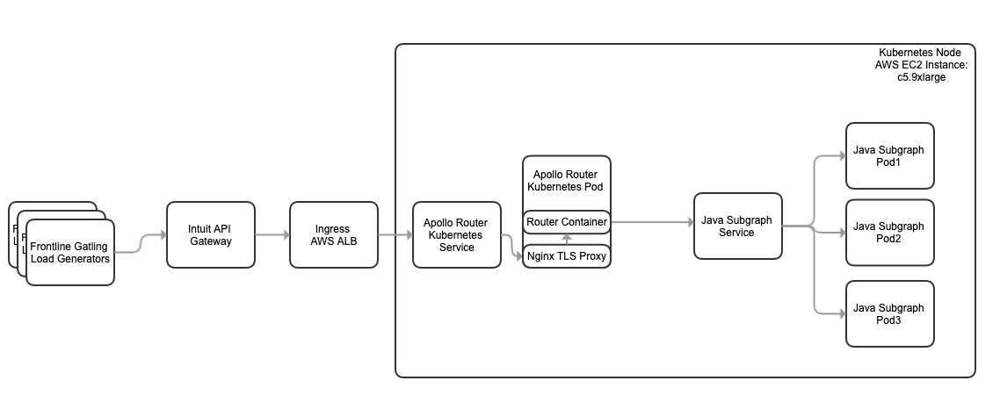
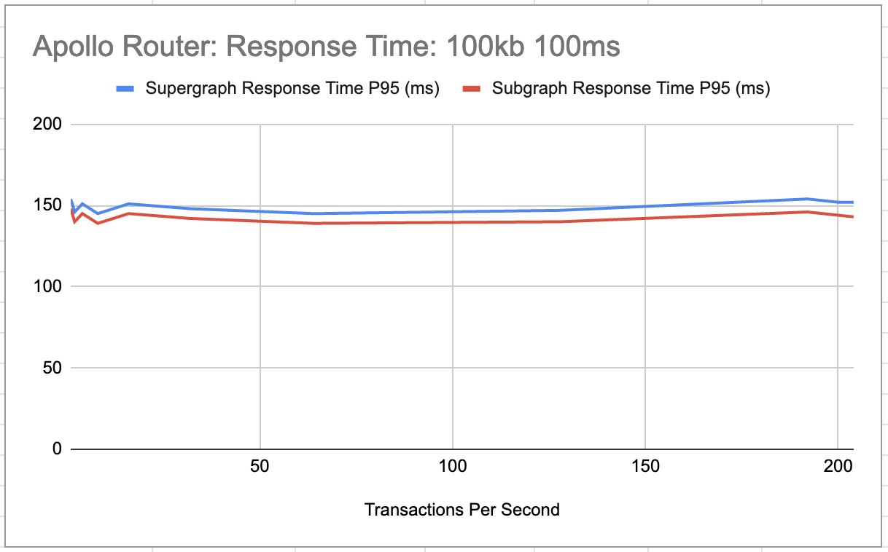
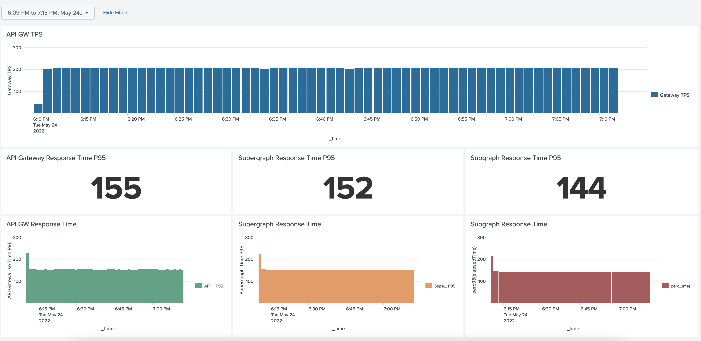
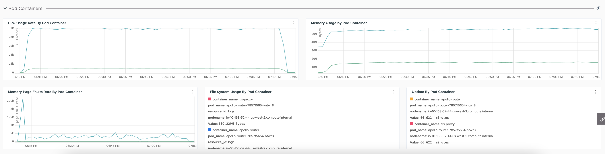

# Apollo-Router 100KB Response Payload Perf Results

## Perf Setup
* Response Payload = 100kb

More details are in this page: [Perf Setup](../perf-test-setup.MD)

## Synthetic Latency of 100ms

### Test Result

| Transactions Per Second  | Test Status | Client Response Time P95 (ms) | API GW Response Time P95 (ms) | Supergraph Response Time P95 (ms) | Subgraph Response Time P95 (ms) | Time spent in Supergraph (ms) | CPU (millicore) | Memory (MB) | Screenshot Time |
| --- | --- | --- | --- | --- | --- | --- | --- | --- | --- |
| 1 | Success | 173 | 166 | 154 | 148 | 6 | 6 | 42 | [1tps-time](./100msLatency/1tps-time.png), [1tps-sys](./100msLatency/1tps-sys.png)| 
| 2 | Success | 168 | 157 | 146 | 140 | 6 | 11 | 42 | [2tps-time](./100msLatency/2tps-time.png), [2tps-sys](./100msLatency/2tps-sys.png)
| 4 | Success | 164 | 158 | 151 | 145 | 6 | 21 | 47 | [4tps-time](./100msLatency/4tps-time.png), [4tps-sys](./100msLatency/4tps-sys.png)
| 8 | Success | 158 | 153 | 145 | 139 | 6 | 42 | 47 | [8tps-time](./100msLatency/8tps-time.png), [8tps-sys](./100msLatency/8tps-sys.png)
| 16 | Success | 807 | 155 | 151 | 145 | 6 | 80 | 48 | [16tps-time](./100msLatency/16tps-time.png), [16tps-sys](./100msLatency/16tps-sys.png)
| 32 | Success | 277 | 152 | 148 | 142 | 6 | 166 | 48 | [32tps-time](./100msLatency/32tps-time.png), [32tps-sys](./100msLatency/32tps-sys.png)
| 64 | Success | 152 | 149 | 145 | 139 | 6 | 312 | 47 | [64tps-time](./100msLatency/64tps-time.png), [64tps-sys](./100msLatency/64tps-sys.png)
| 128 | Success | 152 | 150 | 147 | 140 | 7 | 607 | 58 | [128tps-time](./100msLatency/128tps-time.png), [128tps-sys](./100msLatency/128tps-sys.png)
| 256 | Failed | - | - | - | - | - | - | - | - |
| 192 | Success | 159 | 157 | 154 | 146 | 8 | 927 | 54 | [192tps-time](./100msLatency/192tps-time.png), [192tps-sys](./100msLatency/192tps-sys.png)
| 224 | Failed | - | - | - | - | - | - | - | - |
| 208 | Failed | - | - | - | - | - | - | - | - |
| 200 | Success | 157 | 155 | 152 | 144 | 8 | 960 | 55 |[200tps-time](./100msLatency/200tps-time.png), [200tps-sys](./100msLatency/200tps-sys.png)
| 204 | Success | 157 | 155 | 152 | 143 | 9 | 1000 | 56 |[204tps-time](./100msLatency/204tps-time.png), [204tps-sys](./100msLatency/204tps-sys.png)

### One hour test duration
| Transactions Per Second  | Test Status | Client Response Time P95 (ms) | API GW Response Time P95 (ms) | Supergraph Response Time P95 (ms) | Subgraph Response Time P95 (ms) | Time spent in Supergraph (ms) | CPU (millicore) | Memory (MB) |
| --- | --- | --- | --- | --- | --- | --- | --- | --- | 
| 204 |Success|157| 155| 152 | 144| 8 |1000| 56 |

#### Response Time

#### System Metrics

